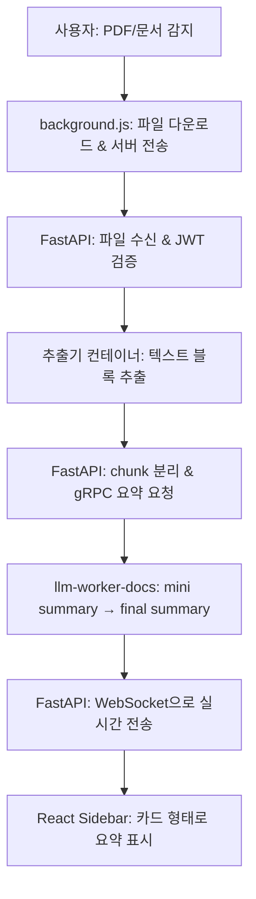

# 📄 문서 요약 전체 파이프라인

## 1. Chrome Extension (프론트엔드)

### 1-1. 문서 감지

```js
// src/utils/pageMode.js
if (url.includes('.pdf') || url.includes('.doc') || url.includes('.docx')) {
  chrome.runtime.sendMessage({ type: "DOCS_DETECTED", url: url });
  return "document";
}
```

### 1-2. background.js에서 파일 다운로드 및 서버 전송

```js
// src/background.js (예시)
chrome.runtime.onMessage.addListener(async (message, sender, sendResponse) => {
  if (message.type === "DOCS_DETECTED") {
    const url = message.url;
    const token = await getJwtToken(); // JWT 토큰 획득 함수
    const fileBlob = await fetch(url).then(res => res.blob());

    const formData = new FormData();
    formData.append("file", fileBlob, "document.pdf");

    await fetch("http://localhost:8000/collect/doc", {
      method: "POST",
      headers: { "Authorization": `Bearer ${token}` },
      body: formData
    });
  }
});
```

---

## 2. FastAPI Backend

### 2-1. collect_docs_router: 파일 수신 및 처리

```python
# routers/collect_docs_router.py (예시)
from fastapi import APIRouter, UploadFile, File, Depends
from .jwt_utils import verify_jwt

router = APIRouter()

@router.post("/collect/doc")
async def collect_doc(file: UploadFile = File(...), user=Depends(verify_jwt)):
    # 1. 파일 저장
    file_path = f"/tmp/{file.filename}"
    with open(file_path, "wb") as f:
        f.write(await file.read())

    # 2. 추출기 컨테이너로 파일 전달
    import requests
    resp = requests.post(
        "http://host.docker.internal:5060/extract",
        files={"file": open(file_path, "rb")}
    )
    blocks = resp.json()["blocks"]  # 텍스트 블록 리스트

    # 3. chunk 단위로 분리
    chunks = chunk_blocks(blocks)

    # 4. gRPC로 요약 요청
    from app.grpc_clients.docs_client import summarize_chunks
    summaries = summarize_chunks(chunks, user_id=user["id"])

    return {"summaries": summaries}
```

### 2-2. websocket_manager: 실시간 전송
user_connections에 user_id 별로 정리
```python
# websocket_manager.py (핵심 부분)
class WebSocketManager:
    def __init__(self):
        self.active_connections: List[WebSocket] = []
        self.user_connections: Dict[str, List[WebSocket]] = {}

    async def connect(self, websocket: WebSocket, user_id: str = None):
        await websocket.accept()
        self.active_connections[user_id] = websocket

    async def send_to_user(self, user_id: str, message: dict):
        for connection in self.user_connections[user_id]:
            await connection.send_json(message)


```

---

## 3. llm-worker-docs (gRPC 서버)

### 3-1. gRPC 프로토콜 정의

```proto
// protos/docssummary.proto
message DocsSummaryRequest {
  string user_id = 1;
  string chunk = 2;  
}

message DocsSummaryResponse {
  string line = 1;  
}

service DocsSummaryService {
  rpc SummarizeStream (stream DocsSummaryRequest) returns (stream DocsSummaryResponse);
}
```

### 3-2. MT5 기반 mini summary

```python
# main.py (핵심 부분)
from transformers import AutoTokenizer, AutoModelForSeq2SeqLM

tokenizer = AutoTokenizer.from_pretrained("csebuetnlp/mT5_multilingual_XLSum")
model = AutoModelForSeq2SeqLM.from_pretrained("csebuetnlp/mT5_multilingual_XLSum")

def mini_summary(text):
    input_ids = tokenizer(text, return_tensors="pt", truncation=True).input_ids
    output = model.generate(input_ids, max_length=48)
    return tokenizer.decode(output[0], skip_special_tokens=True)
```

### 3-3. WatsonX 기반 final summary

```python
# main.py (WatsonX API 호출 예시)
import requests

def watsonx_final_summary(mini_summaries):
    combined = "\n".join(mini_summaries)
    payload = {
        "model_id": "meta-llama/llama-3-70b-instruct",
        "input": combined,
        "parameters": {"max_new_tokens": 256}
    }
    resp = requests.post("https://us-south.ml.cloud.ibm.com/v1/watsonx/generate", json=payload, headers={"Authorization": "Bearer ..."})
    return resp.json()["result"]
```

### 3-4. gRPC stream 응답

```python
# main.py (gRPC 응답 예시)
for chunk in request.chunks:
    mini = mini_summary(chunk)
    yield SummaryResponse(mini_summary=mini)

final = watsonx_final_summary([mini_summary(chunk) for chunk in request.chunks])
yield SummaryResponse(final_summary=final)
```

---

## 4. Frontend Sidebar (React)

### 4-1. WebSocket으로 실시간 요약 수신

```jsx
// src/utils/websocketProvider.jsx (핵심 부분)
const ws = new WebSocket("ws://localhost:8000/ws?user_id=...");

ws.onmessage = (event) => {
  const data = event.data;
  if (data.startsWith("FINAL_SUMMARY:")) {
    setFinalSummary(data.replace("FINAL_SUMMARY:", ""));
  } else {
    setMiniSummaries(prev => [...prev, data]);
  }
};
```

### 4-2. 카드 형태로 요약 표시

```jsx
// components/pages/DocumentSummary.jsx (예시)
{miniSummaries.map((summary, idx) => (
  <Card key={idx} title={`Chunk #${idx+1}`}>
    {summary}
  </Card>
))}
{finalSummary && (
  <Card title="최종 요약" highlight>
    {finalSummary}
  </Card>
)}
```

---

## 전체 흐름 다이어그램



---

## 요약

- 확장 프로그램이 문서를 감지하고, 백엔드로 파일을 전송합니다.
- 백엔드는 파일을 받아 텍스트를 추출하고, chunk별로 gRPC 서버에 요약을 요청합니다.
- llm-worker-docs는 각 chunk를 MT5로 요약하고, 최종적으로 WatsonX로 전체 요약을 생성합니다.
- 모든 요약 결과는 WebSocket을 통해 프론트엔드에 실시간으로 전달되어, 카드 형태로 표시됩니다.
